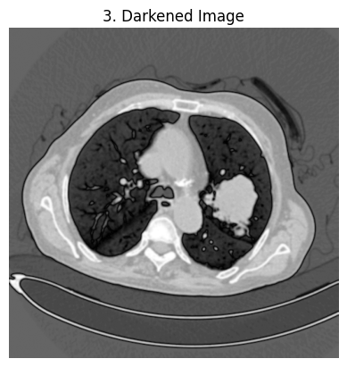

# Lung-cancer-segmentation

This Python script is designed to detect and classify tumors in medical images (e.g., X-rays or CT scans) using image processing techniques. The script processes an input grayscale image, segments the lungs, enhances the image for tumor detection, and classifies detected tumors as either cancerous or benign based on predefined rules.

## Features
- **Noise Reduction**: Applies Gaussian blur to reduce noise in the image.
- **Image Darkening**: Darkens the image to improve contrast for segmentation.
- **Thresholding**: Uses Otsu's method for binary thresholding.
- **Lung Segmentation**: Identifies and isolates the lungs using connected components analysis.
- **Tumor Detection**: Enhances the segmented lungs and applies thresholding to detect suspicious regions.
- **Tumor Classification**: Classifies tumors as cancerous or benign based on area, circularity, and intensity features.
- **Visualization**: Displays intermediate and final results at each step for easy debugging and understanding.

## Requirements
To run this script, you need the following Python libraries:
- `opencv-python` (`cv2`)
- `numpy`
- `matplotlib`
- `scipy`

## Usage
1. Place your medical image (e.g., X-ray or CT scan) in the project directory or provide the full path to the image.
2. Update the image_path variable in the script with the path to your image.
3. Run the script

## Code Overview
The script performs the following steps:
1. Load the Image: Reads the input grayscale image.
2. Apply Gaussian Blur: Reduces noise in the image.
3. Darken the Image: Improves contrast for better segmentation.
4. Thresholding: Uses Otsu's method to create a binary image.
5. Lung Segmentation: Identifies the lungs using connected components analysis.
6. Fill Holes: Fills holes in the lung mask.
7. Enhance Lungs: Applies CLAHE (Contrast Limited Adaptive Histogram Equalization) to enhance the segmented lungs.
8. Tumor Detection: Detects suspicious regions using thresholding.
9. Morphological Operations: Cleans up the tumor mask using opening and closing operations.
10. Classify Tumors: Classifies tumors as cancerous (red) or benign (green) based on area, circularity, and intensity.
11. Display Results: Visualizes intermediate and final results at each step.

## Notes
- The classification rules (e.g., area, circularity, intensity thresholds) are example values and may need to be adjusted based on your specific dataset.
- Ensure the input image is in grayscale format for optimal results.

## Results
### Step one

### Step 2

### Step 3

### Step 4

### Step 5

### Step 6

### Step 7

### Step 8

### Step 9

### Step 10

